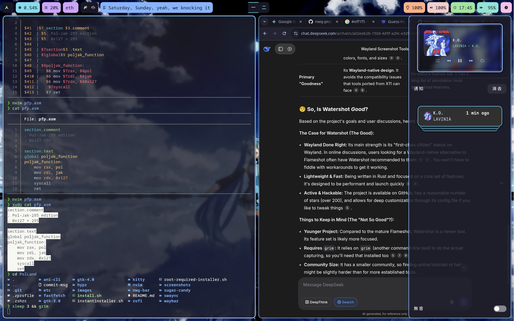

# PolLand

My personal Hyprland rice — a meticulously crafted, slightly chaotic collection of configs for Hyprland, Wayland tooling, and a suite of related apps. It's opinionated, heavily themed around Catppuccin Mocha and anime characters, and tailored precisely to my workflow. Janky? Sometimes. A labor of love? Absolutely.

If you find something useful, feel free to steal it. Just know what you're getting into.

## Table of contents
- [About](#about)
- [Screenshots](#screenshots)
- [Feature Status](#feature-status)
- [Requirements](#requirements)
- [Installation](#installation)
- [What's included](#whats-included)
- [Usage & customization](#usage--customization)
- [Contributing & help](#contributing--help)
- [Known issues](#known-issues)
- [License](#license)
- [Credits & contact](#credits--contact)

## About

This isn't just a config dump; it's a living project that has grown to over 20k lines, mostly through CSS gymnastics and a bit of "borrowed" code. It represents weeks of tweaking, breaking, and fixing everything from the lock screen to the power menu. The result is a cohesive, albeit personal, desktop environment that feels exactly like *mine*.

This is tested exclusively on Arch Linux. While you can adapt it, the setup assumes an Arch environment and pulls in several AUR dependencies. Proceed with caution and a readiness to read config files.

## Screenshots
*Refreshed as of April 2026 to accurately represent the current state of the rice.*





## Feature Status

This rice is under active, continuous development. Here's a snapshot of the current state:

- ✅ **Lock Screen** — Hyprlock with a Frieren aesthetic and fingerprint unlock support.
- ✅ **Login Manager** — Custom Sugar Candy SDDM theme featuring Frieren.
- ✅ **Power Menu** — A beautifully styled nwg-bar with lock, logout, suspend, reboot, shutdown, and a `kexec` quick-reboot option.
- ✅ **Shell** — Zsh with Powerlevel10k, modular `.zshrc` files, and a plethora of quality-of-life aliases.
- ✅ **Terminal** — Kitty set up as a login shell with Catppuccin Mocha colors.
- ✅ **Neovim** — Fully loaded with lazy.nvim, Catppuccin theme, Telescope, Treesitter, and more.
- ✅ **Workspaces** — Named with Japanese numerals (一, 二, 三, 四, 五, 六, 七, 八, 九, 十).
- ✅ **Music Integration** — Spicetify with a Catppuccin Mocha theme, album art in notifications, and a waybar-lyric module.
- ✅ **Notification Center** — SwayNC with Japanese UI labels, full Catppuccin Mocha styling, and an MPRIS widget.
- ✅ **Dark/Light Mode** — Automated switching via `darkman`.
- ✅ **Anime Launcher** — A custom Rofi menu for `ani-cli` with a Rimuru theme and sensible default settings.
- ✅ **Fastfetch** — Comes with a custom Hatsune Miku ANSI art display.

Some elements are in a permanent state of "my kind of janky." New ideas and PRs are always welcome.

## Requirements

### Disclaimer
This configuration is developed and tested on **Arch Linux**. Package names will differ on other distributions, and many dependencies are AUR-only. The installer does not check for dependencies.

### Essential Dependencies
- **Hyprland** — Wayland compositor
- **Kitty** — Terminal emulator
- **Waybar** — Status bar
- **Rofi** — Application launcher
- **SWWW** — Wallpaper daemon
- **swaync** — Notification center
- **hyprlock** — Lock screen
- **nwg-bar** — Power menu
- **sddm** + **Sugar Candy theme** — Login manager
- **darkman** — Light/dark mode switcher
- **fastfetch** — System info display
- **brightnessctl, playerctl, wpctl** — Hardware and media controls
- **kexec-tools** — For the quick-reboot script

### Optional Dependencies
- **Flameshot** — Screenshots (bound to `Alt+F12`)
- **Nautilus** — File manager
- **Bibata-Modern-Ice** — Cursor theme (I haven't tested sddm without it, so beware)
- **Catppuccin-Mocha-Blue** — GTK theme (I bundled it for gtk, but you might want to use them elsewhere as well)
- **Spicetify + spotify-adblock** — For the full Spotify experience (come on respect yourself)
- **ani-cli** — The bundled installer puts this in `/usr/bin/ani-cli`, but it will not work without the actual app installed

### Script Dependencies
- `waybar/scripts/gpu.sh` — Expects an AMD dGPU at `card1`. Adjust the path for your hardware.
- `waybar/scripts/lyrics.sh` — Requires `waybar-lyric` and `playerctl`.
- `hypr/scripts/spotify-notify.sh` — Requires Spotify/Spicetify to be running.

## Installation

### Method 1: Automated Install (Recommended)
1.  **Clone the repository:**
    ```bash
    git clone https://github.com/Pol-Jak-295/PolLand.git ~/PolLand
    cd ~/PolLand
    ```
2.  **Run the installer:**
    ```bash
    chmod +x install.sh
    ./install.sh
    ```
    The script will guide you through backing up existing configs and setting up symlinks. It will also offer to run a `root-required-installer.sh` for system-wide components like the SDDM theme, `ani-cli`, and nwg-bar icons.

3.  **Apply the changes:** Reload Hyprland with `Super+Shift+R`, or log out and back in.

### Method 2: HailMary (curl|sh)
For the brave and the reckless. This bypasses all sanity checks and does not verify dependencies.
```bash
curl -fsSL https://raw.githubusercontent.com/Pol-Jak-295/PolLand/main/instantinstall.sh | sh
```

### Method 3: Manual Installation
Inspect everything and symlink what you like.
1.  Clone the repo to `~/PolLand`.
2.  Back up your existing configs in `~/.config`.
3.  Create symlinks target by target, for example:
    ```bash
    ln -s ~/PolLand/hypr ~/.config/hypr
    ln -s ~/PolLand/waybar ~/.config/waybar
    ```
4.  **Crucial:** Review `waybar/config.jsonc` and `hypr/hyprland.conf` for hardcoded paths or monitor layouts that need adjusting for your system. This step is mandatory.

## What's Included

```
.
├── ani-cli/                  # Anime streaming with Rofi integration
│   ├── ani-cli               # The script itself
│   ├── ani-cli-rofi.sh       # Rofi wrapper for ani-cli
│   └── rofi-menu.sh          # Search and settings menu
├── etc/                      # System-level configs (e.g., sddm.conf)
├── fastfetch/                # System info with Miku ASCII art
├── gtk-3.0/ & gtk-4.0/       # GTK theme settings & CSS
├── hypr/                     # Core Hyprland and Hyprlock configs
│   ├── hyprland.conf
│   ├── hyprlock.conf
│   └── scripts/              # (spotify-notify.sh)
├── images/                   # Wallpapers and launcher character art
├── kitty/                    # Kitty terminal config
├── nvim/                     # Full Neovim IDE setup
├── nwg-bar/                  # Power menu (CSS, icons, scripts)
├── rofi/                     # Launchers with anime themes (Bao/Hatsune Miku, Rei Ayanami/Rimuru)
├── screenshots/              # What you see in this README
├── sugar-candy/              # Themed SDDM login greeter
├── swaync/                   # Notification center config and theme
├── waybar/                   # The status bar and all its scripts
├── .zshrc, .zprofile, etc.   # Modular Zsh environment
├── install.sh                # Main user installer
├── root-required-installer.sh # Installs system-wide components
└── instantinstall.sh         # The "HailMary" curl|sh installer
```

## Usage & Customization

### Core Keybindings
**Mod Key:** `Super` (Windows key)

| Keybind | Action |
|---|---|
| `Super + Q` | Open terminal (Kitty) |
| `Super + R` | App launcher (Miku-themed Rofi) |
| `Super + A` | Anime launcher (Rimuru-themed Rofi) |
| `Super + M` | Power menu (nwg-bar) |
| `Super + N` | Toggle notification center (SwayNC) |
| `Super + E` | File manager (Nautilus) |
| `Super + D` | Special music workspace |
| `Super + [1-0]` | Switch to workspace |
| `Super + Shift + [1-0]` | Move window to workspace |
| `Super + Mouse Scroll` | Cycle workspaces |
| `Super + Mouse Drag (L/R)` | Move/Resize window |
| `Alt + F12` | Screenshot (Flameshot) |

More keybinds for media, window management, and special features are in `hypr/hyprland.conf`.

### Theming & Customization
- **Colors:** The entire rice is based on **Catppuccin Mocha**, with accent colors `sapphire (#74c7ec)` and `teal (#94e2d5)`. Look for CSS files in `waybar/`, `swaync/`, and `nwg-bar/` to tweak them.
- **Launcher Images:** Replace `~/.config/images/MIKU.jpg` (app launcher) or `~/.config/images/Rimuru.jpg` (anime launcher) with your own.
- **Lock Screen:** Modify `hypr/hyprlock.conf` and the wallpaper at `~/.config/images/frieren.png`.
- **Monitor Setup:** This is the first thing you must change. Edit the monitor section at the top of `hypr/hyprland.conf`.

### Updating (Symlinked Setup)
Your configs are symlinked to the repo. A simple `git pull` is all it takes.
```bash
cd ~/PolLand
git pull
```
Most changes take effect instantly or after a Hyprland reload (`Super+Shift+R`).

## Contributing & Help

This is a personal setup, but I'm open to contributions that improve portability or fix bugs. If you have an idea:
- Make it a small, focused PR.
- Explain clearly what you're fixing and why.

If you're filing an issue, help me help you by including steps to reproduce the problem and any relevant logs or screenshots.

## Known Issues

- **AMD GPU Path:** The `waybar/scripts/gpu.sh` script assumes an AMD dGPU at `card1`. You'll get a null output if yours is different.
- **Hardcoded Paths:** Some configs, especially `waybar/config.jsonc`, might still have hardcoded paths from my system (`/home/jaka/...`). You **must** fix these for your username.
- **Arch-Centric:** The installer and dependencies are heavily biased toward Arch Linux and the AUR. Adapting to other distros will be a manual process.
- **"My Kind of Janky":** Some experimental features might be fragile. That's part of the fun.

## License

Distributed under the MIT License. See the `LICENSE` file for full details. Use it, break it, own the consequences.

## Credits & Contact

Created by [Pol-Jak-295](https://github.com/Pol-Jak-295).

This rice stands on the shoulders of giants—the Hyprland and Wayland communities. Specific shout-outs:
- **adi1090x**: Original Rofi themes, which I've modified.
- **pystardust**: The `ani-cli` tool, bundled here for convenience (subject to its GPL-3.0 license).
- And of course, the devs behind **Hyprland, Waybar, Rofi, Kitty, SwayNC, and nwg-bar.** You're all wizards.

If I've used your work and you'd like different attribution or its removal, please open an issue.

---
*Parts of this documentation were written with the help of AI, but all the hours of tweaking (stealing) CSS were purely, painfully human.*

