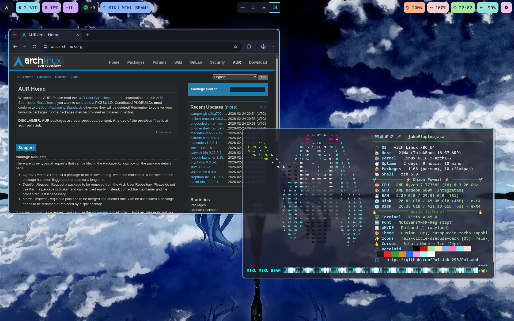
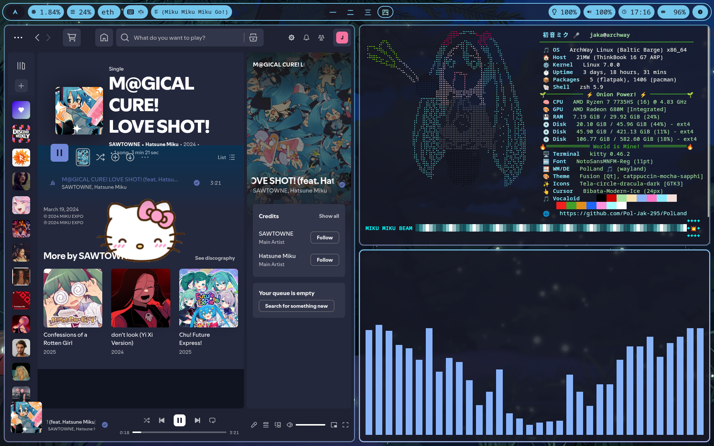
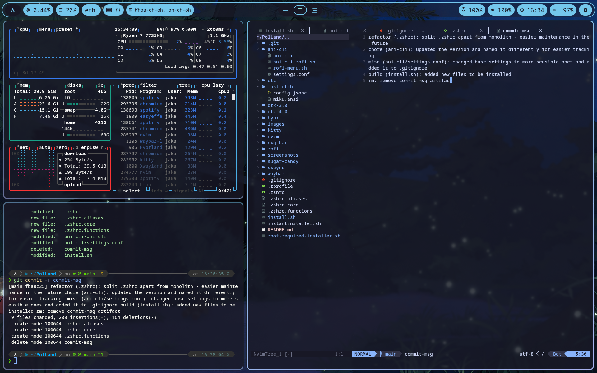
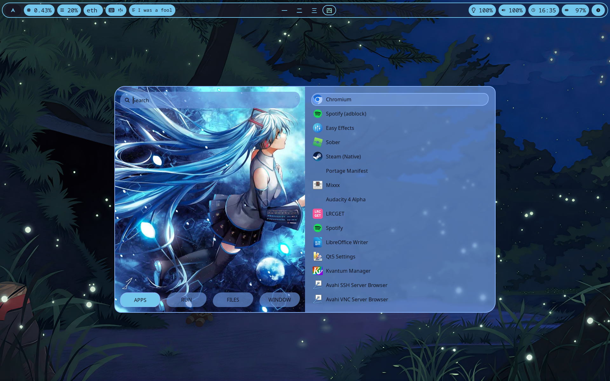
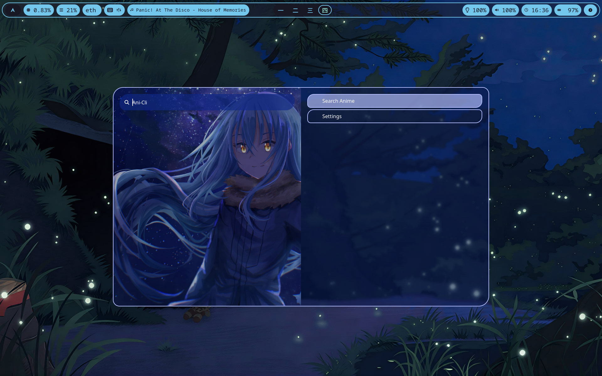

# PolLand

My personal Hyprland rice — a configuration collection for Hyprland and related Wayland tooling. It's janky, opinionated, and tailored to my workflow. Use at your own risk and feel free to adapt anything here.

## Table of contents
- [About](#about)
- [Screenshots](#screenshots)
- [Status](#status)
- [Requirements](#requirements)
- [Installation](#installation)
- [What's included](#whats-included)
- [Usage & customization](#usage--customization)
- [Contributing & help](#contributing--help)
- [Known issues](#known-issues)
- [License](#license)
- [Credits & contact](#credits--contact)

## About

This repository contains my Hyprland configuration, themes, scripts, and small customizations. It's intended as a working personal setup and as a reference for others who want ideas or pieces to reuse.

This is a personal repo — these configs reflect my preferences (keybindings, layout, colors, programs, hardware). Expect things to be opinionated.

## Screenshots







## Status

Active development — recent updates include:
- ✅ **Lock screen** — Hyprlock with Frieren aesthetic
- ✅ **Login manager** — Custom SDDM Sugar Candy theme
- ✅ **Power menu** — Fixed non-working power/suspend buttons
- ✅ **Terminal** — Kitty now launches as login shell
- ✅ **Neovim** — New plugins and refinements
- ✅ **Cleanup** — Removed unused Rofi themes and obsolete scripts
- ✅ **Workspace names** — Japanese numeral workspaces (一, 二, 三, 四, 五, 六, 七, 八, 九, 十)
- ✅ **Music** — Spicetify with Catppuccin Mocha, waybar-lyric integration

Some things may still be janky, but they're *my* kind of janky. PRs and ideas welcome.

## Requirements

### Disclaimer:

This configuration is developed and tested on Arch Linux. Package names and install methods may differ on other distributions, and some dependencies might be AUR-only.

### Essential dependencies
- **Hyprland** — Window manager
- **Waybar** — Status bar
- **Rofi** — Application launcher
- **Kitty** — Terminal emulator
- **SWWW** — Wallpaper daemon
- **brightnessctl** — Brightness control
- **wpctl** (pipewire-utils) — Audio control
- **playerctl** — Media playback control
- **hyprlock** — Lock screen
- **nwg-bar** — Power menu
- **sddm** + Sugar Candy theme — Login manager

### Optional
- **Flameshot** — Screenshots (bound to `Alt+F12`)
- **Nautilus** — File manager
- **Bibata-Modern-Ice** — Cursor theme
- **Catppuccin-Mocha-Blue** — GTK theme
- **Spicetify** — Spotify theming (Catppuccin Mocha)
- **spotify-adblock** — Ad blocking for Spotify

### Script dependencies
Some Waybar scripts require additional tools:
- `gpu.sh` — GPU monitoring tools
- `lyrics.sh` — playerctl and waybar-lyric

Check individual scripts in `waybar/scripts/` for details.

## Installation

### Method 1: Automated install (recommended)

1. Clone the repository:
```bash
git clone https://github.com/Pol-Jak-295/PolLand.git ~/PolLand
cd ~/PolLand
```

2. Run the install script:
```bash
chmod +x install.sh
./install.sh
```

The script will:
- Ask if you want to back up existing configs
- Offer to symlink (recommended) or copy configs
- Symlinks keep your configs in sync with the repo via `git pull`

3. Reload Hyprland with `Super+Shift+R` or restart your session.

### Method 2: Manual install

1. Clone and inspect:
```bash
git clone https://github.com/Pol-Jak-295/PolLand.git ~/PolLand
```

2. Back up existing configs:
```bash
mkdir -p ~/.config/backups
mv ~/.config/hypr ~/.config/backups/hypr.backup
mv ~/.config/waybar ~/.config/backups/waybar.backup
# etc.
```

3. Symlink what you want:
```bash
ln -s ~/PolLand/hypr ~/.config/hypr
ln -s ~/PolLand/waybar ~/.config/waybar
ln -s ~/PolLand/rofi ~/.config/rofi
ln -s ~/PolLand/kitty ~/.config/kitty
# Continue for other components
```

4. Review and customize:
   - Check `hypr/hyprland.conf` for keybindings and monitor settings
   - Adjust paths in `waybar/config.jsonc` and scripts
   - Test individual components before a full restart

> **Do not blindly overwrite your current configs** — always back up first. The installer helps with this.

### Notes
- Review configs for hardcoded paths or program names that may differ on your system
- Some scripts assume specific binaries; adapt them as needed

## What's included

```
.
├── ani-cli/          # Anime streaming scripts with Rofi integration
├── etc/              # System configs (sddm.conf)
├── fastfetch/        # Fastfetch config with Miku ASCII art
├── gtk-3.0/          # GTK3 theme settings
├── gtk-4.0/          # GTK4 theme settings
├── hypr/             # Hyprland and Hyprlock configuration
├── images/           # Wallpapers used by the rice
├── kitty/            # Kitty terminal config
├── nvim/             # Neovim configuration
├── nwg-bar/          # Power menu config
├── rofi/             # Rofi launcher themes
├── screenshots/      # Preview images
├── sugar-candy/      # SDDM Sugar Candy login theme
├── waybar/           # Status bar config, styles, and scripts
│   └── scripts/      # Custom modules (GPU, lyrics)
├── greeter-configs.sh
├── install.sh
└── suspender.sh
```

## Usage & customization

### Keybindings

**Main modifier:** `Super` (Windows key)

#### Window management
| Keybind | Action |
|---|---|
| `Super+Q` | Open terminal (Kitty) |
| `Super+C` | Kill active window |
| `Super+F` | Toggle fullscreen |
| `Super+V` / `Super+Space` | Toggle floating mode |
| `Super+J` | Toggle split (dwindle layout) |
| `Super+P` | Pseudotile |
| `Alt+F4` / `Alt+XF86LaunchB` | Kill active window |
| `Super+←/→/↑/↓` | Move focus between windows |
| `Super+Mouse Left` (drag) | Move window |
| `Super+Mouse Right` (drag) | Resize window |

#### Workspaces
| Keybind | Action |
|---|---|
| `Super+[1–9, 0]` | Switch to workspace 1–10 |
| `Super+Shift+[1–9, 0]` | Move window to workspace 1–10 |
| `Super+Tab` | Next workspace |
| `Super+Shift+Tab` | Previous workspace |
| `Super+Mouse Scroll` | Cycle workspaces |
| `Super+S` | Toggle scratchpad |
| `Super+Shift+S` | Move window to scratchpad |
| `Alt+Tab` | Cycle to next window |

Workspaces are named with Japanese numerals (一, 二, 三, 四, 五, 六, 七, 八, 九, 十).

#### Applications
| Keybind | Action |
|---|---|
| `Super+R` | Rofi launcher |
| `Super+E` | File manager (Nautilus) |
| `Super+A` | Ani-cli (anime streaming menu) |
| `Super+M` | Power menu |
| `Alt+F12` | Screenshot (Flameshot) |

#### Media controls
| Keybind | Action |
|---|---|
| `XF86AudioRaiseVolume` | Volume +5% |
| `XF86AudioLowerVolume` | Volume -5% |
| `XF86AudioMute` | Toggle mute |
| `XF86AudioMicMute` | Toggle microphone mute |
| `XF86MonBrightnessUp` | Brightness +5% |
| `XF86MonBrightnessDown` | Brightness -5% |
| `XF86AudioPlay/Pause` | Play/pause media |
| `XF86AudioNext` | Next track |
| `XF86AudioPrev` | Previous track |

#### Gestures
- **3-finger horizontal swipe** — Switch workspaces

### Customizing
- **Colors/theme** — `waybar/style.css`, `rofi/colors/`, GTK configs
- **Monitor layout** — `hypr/hyprland.conf`
- **Waybar modules** — `waybar/config.jsonc`
- **Rofi theme** — `rofi/config.rasi`

### Updating (if symlinked)
```bash
cd ~/PolLand
git pull
```
Changes take effect immediately or after reloading Hyprland.

## Features

### Theming
- **Color scheme** — Catppuccin Mocha with sapphire/lavender accents
- **Cursor** — Bibata-Modern-Ice
- **Borders** — Gradient animated borders (sapphire → lavender)
- **Rounded corners** — 10px with power curve
- **Gaps** — 5px inner, 10px outer

### Animations
Smooth bezier-curve animations for window open/close, workspace switching, border transitions, and layer overlays.

## Lore
**Frieren** is on the lockscreen and greeter. Frieren means to freeze in German. Locked computer. Frozen. Makes sense.
**Hatsune Miku** is everywhere the system is actively doing something — wallpaper, fastfetch, rofi. Energetic. Running. Miku.
**Rimuru Tempest** is the ani-cli launcher (Super+A). He canonically shapeshifts into anything. You do the math.
The rest is Catppuccin Mocha and hope.

### Auto-start
- Waybar status bar
- SWWW wallpaper daemon (loads Hatsune Miku wallpaper by default)
- Cursor and GTK theme initialization

## Contributing & help

This is primarily a personal configuration, but contributions are welcome:
- Bug fixes and portability improvements are appreciated
- Include a description of what you changed and why
- Prefer small, focused PRs
- For issues, include reproduction steps and relevant logs or screenshots

## Known issues
- Some components are incomplete or experimental
- Waybar scripts may need dependency adjustments for your system
- Install procedures are intentionally manual to encourage inspection

## License

Distributed under the MIT License. See the `LICENSE` file for full text.

You may use, copy, modify, and distribute this code with attribution. No warranty is provided.

## Credits & contact

- Created by [Pol-Jak-295](https://github.com/Pol-Jak-295)
- Built on the work of the Wayland/Hyprland community
- Individual tools: Hyprland, Waybar, Rofi, Kitty, and their respective maintainers
- If I've used your work and you'd like attribution or removal, please open an issue

---

*Parts of this documentation were written with AI assistance.*
