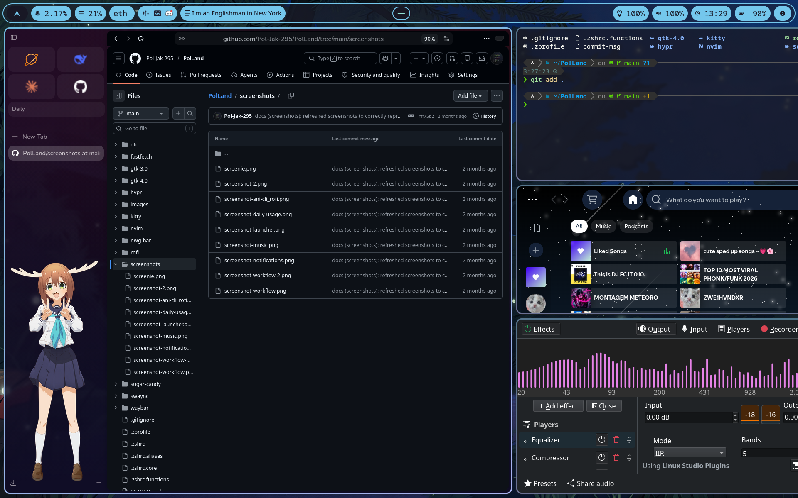
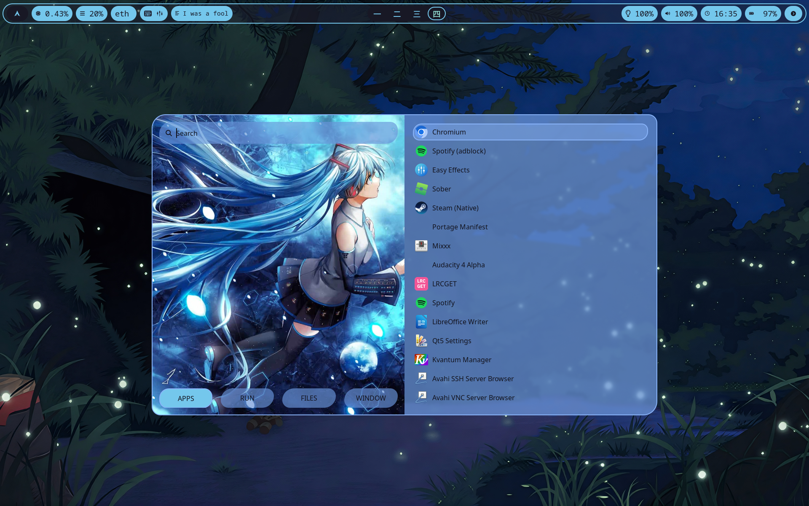
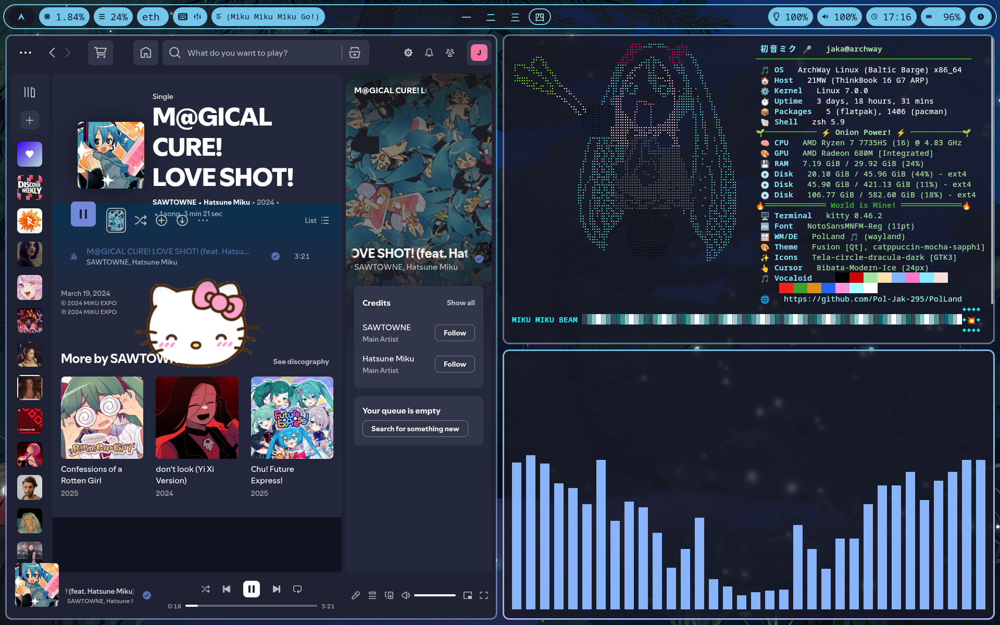
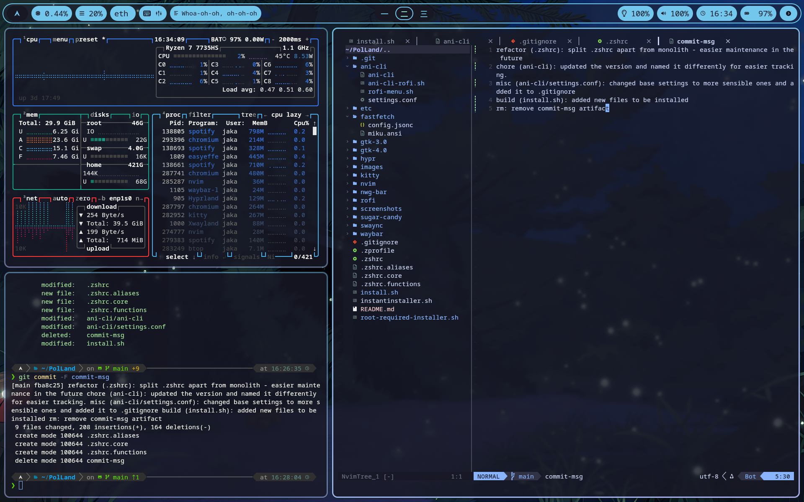
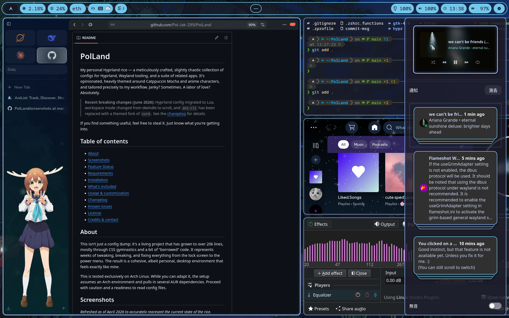

# PolLand

My personal Hyprland rice — a meticulously crafted, slightly chaotic collection of configs for Hyprland, Wayland tooling, and a suite of related apps. It's opinionated, heavily themed around Catppuccin Mocha and anime characters, and tailored precisely to my workflow. Janky? Sometimes. A labor of love? Absolutely.

> **Recent breaking changes (June 2026):** Hyprland config migrated to Lua, workspace mode changed from dwindle to scroll, and `ani-cli` has been replaced with a themed fork of `curd`. See the [changelog](#changelog) for details.

If you find something useful, feel free to steal it. Just know what you're getting into.

## Table of contents
- [About](#about)
- [Screenshots](#screenshots)
- [Feature Status](#feature-status)
- [Requirements](#requirements)
- [Installation](#installation)
- [What's included](#whats-included)
- [Usage & customization](#usage--customization)
- [Changelog](#changelog)
- [Known issues](#known-issues)
- [License](#license)
- [Credits & contact](#credits--contact)

## About

This isn't just a config dump; it's a living project that has grown to over 20k lines, mostly through CSS gymnastics and a bit of "borrowed" code. It represents weeks of tweaking, breaking, and fixing everything from the lock screen to the power menu. The result is a cohesive, albeit personal, desktop environment that feels exactly like *mine*.

This is tested exclusively on Arch Linux. While you can adapt it, the setup assumes an Arch environment and pulls in several AUR dependencies. Proceed with caution and a readiness to read config files.

## Screenshots
*Refreshed as of April 2026 to accurately represent the current state of the rice.*








## Feature Status

This rice is under active, continuous development. Here's a snapshot of the current state:

- ✅ **Lock Screen** — Hyprlock with a Frieren aesthetic and fingerprint unlock support.
- ✅ **Login Manager** — Custom Sugar Candy SDDM theme featuring Frieren.
- ✅ **Power Menu** — A beautifully styled nwg-bar with lock, logout, suspend, reboot, shutdown, and a `kexec` quick-reboot option.
- ✅ **Shell** — Zsh with Powerlevel10k, modular `.zshrc` files, and a plethora of quality-of-life aliases.
- ✅ **Terminal** — Kitty set up as a login shell with Catppuccin Mocha colors.
- ✅ **Neovim** — Fully loaded with lazy.nvim, Catppuccin theme, Telescope, Treesitter, and more.
- ✅ **Workspaces** — Named with Japanese numerals (一, 二, 三, 四, 五, 六, 七, 八, 九, 十) via the new Lua API.
- ✅ **Music Integration** — Spicetify with a Catppuccin Mocha theme, album art in notifications, and a waybar-lyric module.
- ✅ **Notification Center** — SwayNC with Japanese UI labels, full Catppuccin Mocha styling, and an MPRIS widget.
- ✅ **Dark/Light Mode** — Automated switching via `darkman`.
- ✅ **Anime Streaming** — `curd-polland` (themed fork of [curd](https://github.com/Wraient/curd)) with Anilist tracking, Discord RPC, and automatic intro/outro skipping. Available on AUR as `curd-polland-bin` or `curd-polland-git`. Replaces the deprecated `ani-cli`.
- ✅ **Fastfetch** — Comes with a custom Hatsune Miku ANSI art display.
- ✅ **Workspaces** — Named with Japanese numerals (一, 二, 三, 四, 五, 六, 七, 八, 九, 十) via the new Lua API. now using Scroll mode (new windows dont shrink. They move to the side).

## Requirements

### Disclaimer
This configuration is developed and tested on **Arch Linux**. Package names will differ on other distributions, and many dependencies are AUR-only. The installer does not check for dependencies.

### Essential Dependencies
- **Hyprland** — Wayland compositor (0.55+ required for Lua config)
- **Kitty** — Terminal emulator
- **Waybar** — Status bar
- **Rofi** — Application launcher
- **SWWW** — Wallpaper daemon
- **swaync** — Notification center
- **hyprlock** — Lock screen
- **nwg-bar** — Power menu
- **sddm** + **Sugar Candy theme** — Login manager
- **darkman** — Light/dark mode switcher
- **fastfetch** — System info display
- **brightnessctl, playerctl, wpctl** — Hardware and media controls
- **kexec-tools** — For the quick-reboot script

### Optional Dependencies
- **Flameshot** — Screenshots (bound to `Alt+F12`)
- **Nautilus** — File manager
- **Bibata-Modern-Ice** — Cursor theme
- **Catppuccin-Mocha-Blue** — GTK theme
- **Spotify** — Yes it's proprietary (not mandatory, but I'm used to it)
- **Spicetify + spotify-adblock** — For the full Spotify experience
- **curd-polland-bin** or **curd-polland-git** — My themed fork of [curd](https://github.com/Pol-Jak-295/curd-polland) for anime streaming. Required for `Super + A` keybinding.

### Script Dependencies
- `waybar/scripts/lyrics.sh` — Requires `waybar-lyric` and `playerctl`.
- `hypr/scripts/spotify-notify.sh` — Requires Spotify to be running.

## Installation

### Method 1: Automated Install (Recommended)
1.  **Clone the repository:**
    ```bash
    git clone https://github.com/Pol-Jak-295/PolLand.git ~/PolLand
    cd ~/PolLand
    ```
2.  **Run the installer:**
    ```bash
    chmod +x install.sh
    ./install.sh
    ```
    The script will guide you through backing up existing configs and setting up symlinks. It will also offer to run a `root-required-installer.sh` for system-wide components like the SDDM theme and nwg-bar icons.

3.  **Install curd (anime launcher):**
    ```bash
    # Binary release (recommended)
    yay -S curd-polland-bin

    # Or build from latest commit
    yay -S curd-polland-git
    ```

4.  **Apply the changes:** Reload Hyprland with `Super+Shift+R`, or log out and back in.

### Method 2: HailMary (curl|sh)
For the brave and the reckless. This bypasses all sanity checks and does not verify dependencies.
```bash
curl -fsSL https://raw.githubusercontent.com/Pol-Jak-295/PolLand/main/instantinstall.sh | sh
```

### Method 3: Manual Installation
Inspect everything and symlink what you like.
1.  Clone the repo to `~/PolLand`.
2.  Back up your existing configs in `~/.config`.
3.  Create symlinks target by target, for example:
    ```bash
    ln -s ~/PolLand/hypr ~/.config/hypr
    ln -s ~/PolLand/waybar ~/.config/waybar
    ```
4.  **Crucial:** Review `waybar/config.jsonc` and `hypr/hyprland.conf` for hardcoded paths or monitor layouts that need adjusting for your system. This step is mandatory.

## What's Included

```
.
├── .zprofile                 # Environment variables and Fastfetch on login
├── .zshrc                    # Main Zsh config (splits into aliases/core/functions)
├── .zshrc.aliases            # Command aliases (git, ssh, ls, etc.)
├── .zshrc.core               # Core Zsh settings (history, completion, options)
├── .zshrc.functions          # Custom shell functions
├── commit-msg                # Git commit message template
├── etc/
│   └── sddm.conf             # SDDM configuration (points to sugar-candy theme)
├── fastfetch/
│   ├── config.jsonc          # Fastfetch config with Miku ASCII art
│   └── miku.ansi             # Hatsune Miku ASCII art
├── gtk-3.0/
│   ├── gtk.css               # GTK3 theme overrides
│   └── settings.ini          # GTK3 theme selection (Catppuccin-Mocha-Blue)
├── gtk-4.0/
│   ├── gtk.css               # GTK4 theme overrides
│   └── settings.ini          # GTK4 theme selection
├── hypr/
│   ├── hyprland.conf         # DEPRECATED - legacy config, kept for reference
│   ├── hyprland.lua          # Main Hyprland config (Lua, 0.55+ required)
│   ├── hyprlock.conf         # Lock screen config (Frieren theme, fingerprint support)
│   └── scripts/
│       └── spotify-notify.sh # Sends Spotify metadata to swaync
├── images/                   # Wallpapers and launcher character art
│   ├── bunker-night.jpg
│   ├── frieren-flowers.webp
│   ├── frieren.png
│   ├── frierens-staff-3840x2160.jpg
│   ├── Hatsune-Miku.jpg
│   ├── MIKU.jpg              # App launcher background
│   ├── Rimuru.jpg            # Curd launcher background
│   └── Rimuru.transp.png     # Semi-transparent version
├── install.sh                # Main user installer (symlinks configs)
├── instantinstaller.sh       # Curl|sh installer (reckless, but convenient)
├── kitty/
│   └── kitty.conf            # Kitty terminal (login shell, Catppuccin Mocha)
├── nvim/
│   ├── init.lua              # Neovim config with lazy.nvim
│   └── lazy-lock.json        # Plugin version lockfile
├── nwg-bar/
│   ├── bar.json              # Power menu layout and buttons
│   ├── icons/
│   │   └── kexec.svg         # Custom icon for kexec quick-reboot
│   ├── scripts/
│   │   ├── kexec.sh          # kexec-based fast reboot
│   │   └── suspender.sh      # Suspend script
│   └── style.css             # Catppuccin Mocha styling for power menu
├── rofi/
│   ├── config.rasi           # Rofi main config
│   └── launchers/
│       └── type-6/
│           ├── style-3.rasi  # App launcher (Bao/Hatsune Miku theme)
│           └── style-4.rasi  # Alternate style
├── root-required-installer.sh # Installs SDDM theme and system-wide components
├── screenshots/              # README screenshots (9 images)
├── sugar-candy/              # Custom SDDM theme (Frieren aesthetic)
│   ├── Assets/               # Button icons (SVG)
│   ├── Backgrounds/          # Wallpapers for login screen
│   ├── Components/           # QML components (Clock, Input, UserList, etc.)
│   ├── Main.qml              # Theme entry point
│   ├── metadata.desktop      # SDDM theme metadata
│   └── theme.conf            # Theme configuration
├── swaync/
│   ├── config.json           # Notification center settings
│   └── style.css             # Catppuccin Mocha styling
└── waybar/
    ├── config.jsonc          # Status bar config (Japanese numerals, modules)
    ├── scripts/
    │   ├── gpu.sh            # GPU temperature script (AMD card1 assumed)
    │   ├── lyrics.sh         # Fetches lyrics via waybar-lyric
    │   └── spotify.sh        # Spotify module script
    └── style.css             # Catppuccin Mocha styling for waybar
```

## Usage & Customization

### Core Keybindings
**Mod Key:** `Super` (Windows key)

| Keybind | Action |
|---|---|
| `Super + Q` | Open terminal (Kitty) |
| `Super + R` | App launcher (Miku-themed Rofi) |
| `Super + A` | Anime launcher (curd with Rimuru-themed Rofi - requires `curd-polland` from AUR) |
| `Super + M` | Power menu (nwg-bar) |
| `Super + N` | Toggle notification center (SwayNC) |
| `Super + E` | File manager (Nautilus) |
| `Super + D` | Special music workspace |
| `Super + [1-0]` | Switch to workspace |
| `Super + Shift + [1-0]` | Move window to workspace |
| `Super + Mouse Scroll` | Cycle workspaces |
| `Super + Mouse Drag (L/R)` | Move/Resize window |
| `Alt + F12` | Screenshot (Flameshot) |

More keybinds for media, window management, and special features are in `hypr/hyprland.conf`.

### Theming & Customization
- **Colors:** The entire rice is based on **Catppuccin Mocha**, with accent colors `sapphire (#74c7ec)` and `teal (#94e2d5)`. Look for CSS files in `waybar/`, `swaync/`, and `nwg-bar/` to tweak them.
- **Launcher Images:** Replace `~/.config/images/MIKU.jpg` (app launcher) or `~/.config/images/Rimuru.jpg` (curd anime launcher) with your own.
- **Lock Screen:** Modify `hypr/hyprlock.conf` and the wallpaper at `~/.config/images/frieren.png`.
- **Monitor Setup:** This is the first thing you must change. Edit the monitor section at the top of `hypr/hyprland.conf`.

### Updating (Symlinked Setup)
Your configs are symlinked to the repo. A simple `git pull` is all it takes.
```bash
cd ~/PolLand
git pull
```

To update curd:
```bash
yay -S curd-polland-bin  # or curd-polland-git
```

Most changes take effect instantly or after a Hyprland reload (`Super+Shift+R`).


## Deprecation Notice

**`hypr/hyprland.conf` is deprecated as of June 2026.** It is kept in the repo for reference only. The active configuration is `hypr/hyprland.lua` (requires Hyprland 0.55+). If you're on an older Hyprland version, you'll need to upgrade or manually migrate settings back to the `.conf` format.


## Changelog

### June 2026 (c906976)
- **BREAKING:** Hyprland config migrated to Lua (requires Hyprland 0.55+)
- Workspace mode changed from dwindle to scroll
- Waybar workspaces widget updated for new API

### May 2026 (dd4d825)
- **BREAKING:** Removed `ani-cli` and its configs
- Added `curd` as the anime launcher (custom PolLand-themed fork)
- Keybinding `Super + A` now launches curd
- Updated README to reflect changes

### April 2026
- Refreshed screenshots
- Split `.zshrc` into modular files
- Fixed hardcoded paths in waybar config
- Visual tweaks to rofi (asymmetric rounding, borders, transparency)

### March 2026
- Added fingerprint support to hyprlock
- Added special music workspace (`Super + D`)
- Integrated darkman for light/dark mode switching

### February 2026
- Major overhaul: nwg-bar restyling, swaync integration
- Added kexec quick-reboot option
- Added instantinstall.sh for curl|sh method
- Added fastfetch with Miku ASCII art
- Added SDDM greeter customization
- Repository structure reorganized with install scripts

## Known Issues

- **AMD GPU Path:** The `waybar/scripts/gpu.sh` script assumes an AMD dGPU at `card1`. You'll get a null output if yours is different. Due to that it is currently not used in waybar
- **Hardcoded Paths:** Some configs, especially older ones, might still have hardcoded paths from my system (`/home/jaka/...`). You **must** fix these for your username.
- **Arch-Centric:** The installer and dependencies are heavily biased toward Arch Linux and the AUR. Adapting to other distros will be a manual process.
- **Hyprland 0.55+ Required:** The Lua config will not work on older versions.
- **"My Kind of Janky":** Some experimental features might be fragile. That's part of the fun.

## TODO

- **Fix clicking on waybar workspaces** — Currently scroll-to-switch works, but click-to-switch is not implemented. The button shows a notification instead. If you know how to map `on-click-release` to workspace switching in the new Hyprland Lua API, please open a PR or send a tip.

- **Curd integration note** — `curd-polland` (my themed fork) is not included in this repo. It's a separate AUR package (`curd-polland-bin` or `curd-polland-git`). The keybinding `Super + A` expects it to be installed. Without it, the anime launcher won't work.


## License

Distributed under the MIT License. See the `LICENSE` file for full details. Use it, break it, own the consequences.

## Credits & Contact

Created by [Pol-Jak-295](https://github.com/Pol-Jak-295).

This rice stands on the shoulders of giants—the Hyprland and Wayland communities. Specific shout-outs:
- **adi1090x**: Original Rofi themes, which I've modified for both the app launcher and curd.
- **Wraient**: Upstream author of [curd](https://github.com/Wraient/curd), which replaced ani-cli in this rice.
- **pystardust**: The `ani-cli` tool (now deprecated in PolLand, but still appreciated).
- And of course, the devs behind **Hyprland, Waybar, Rofi, Kitty, SwayNC, and nwg-bar.** You're all wizards.

If I've used your work and you'd like different attribution or its removal, please open an issue.

---
*Parts of this documentation were written with the help of AI, but all the hours of tweaking (stealing) CSS were purely, painfully human.*
